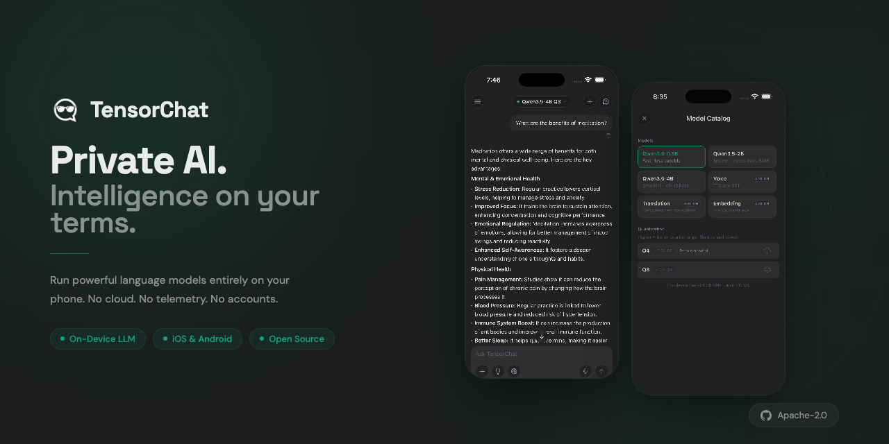

# TensorChat

<p align="center">
  
</p>

[](https://tensorchat.app)
[](https://apps.apple.com/us/app/tensorchat-private-ai/id6760141754)
[](LICENSE)

A private, on-device AI chatbot for iOS and Android. All LLM inference runs locally via a [llama.rn fork](https://github.com/zhi-x-ye/llama.rn) (based on [mybigday/llama.rn](https://github.com/mybigday/llama.rn)). No accounts, no telemetry, no cloud calls by default.

## Features

- **On-device everything** — chat, vision, voice, mini-apps, and RAG all run locally. The only network calls are optional: model downloads from HuggingFace and per-chat DuckDuckGo web search
- **Mini App Builder** — describe an app in natural language and the AI builds it on-device. Interactive apps (calculators, todo lists, trackers) rendered in a sandboxed WebView with a 12-component runtime
- **Vision** — drop in an image and ask about it (multimodal models: Qwen3.5, Gemma 4)
- **Voice I/O** — on-device speech-to-text and text-to-speech via [sherpa-onnx](https://github.com/k2-fsa/sherpa-onnx) and Kokoro TTS
- **File Vault (RAG)** — ingest PDFs and documents into a local vector store (op-sqlite + EmbeddingGemma), with on-device OCR fallback for scanned PDFs
- **Thinking mode** — streamed chain-of-thought reasoning on models that support it
- **Agentic tool calling** — built-in web search tool callable by the model, with a ReAct agent loop for multi-step reasoning
- **Streaming tokens** — real-time generation with thinking/answer separation
- **In-app model catalog** — browse, download, and swap models without leaving the app

## Supported Models

All models are GGUF builds sourced from HuggingFace and loaded via our [llama.rn fork](https://github.com/zhi-x-ye/llama.rn).

| Family | Sizes | Vision | Notes |
|---|---|---|---|
| **Qwen3.5** | 0.8B, 2B, 4B | Yes | Recommended default; best mini-app builder performance |
| **Gemma 4 E2B** | 2B effective | Yes | Native reasoning; Google multimodal |
| **Nemotron 3 Nano** | 4B | No | NVIDIA reasoning model |
| **LFM2.5** | 350M, 1.2B | No | LiquidAI ultra-lightweight for older devices |

Quantizations: `Q3_K_M`, `Q4_K_M` (recommended), `Q8_0`, `BF16`, `UD_IQ2_M`.

Additional models: **EmbeddingGemma 300M** (Q4_0) for File Vault embeddings, **EuroLLM 1.7B** and **TranslateGemma 4B** for translation.

The full catalog is defined in [`src/constants/models.ts`](src/constants/models.ts).

## Getting Started

### Prerequisites

- Node.js 18+
- Xcode (for iOS) or Android Studio (for Android)
- A physical device or simulator/emulator
- [CocoaPods](https://cocoapods.org/) for iOS

> Expo Go is **not** supported — the llama.rn fork is a native module and requires a [development build](https://docs.expo.dev/develop/development-builds/introduction/).

### Install and run

```bash
git clone https://github.com/general-intelligence-inc/tensorchat.git
cd tensorchat
npm install

# Start the Expo dev server
npm start

# Build & run on a device/simulator
npm run ios      # iOS
npm run android  # Android
```

### Local iOS release build

For a release-like local build that mirrors the production EAS profile:

```bash
# Also requires Fastlane on your PATH: brew install fastlane
npm run build:release-like:ios:local
```

This uses a repo-local npm cache at `.npm-cache/` so it still works even if your global `~/.npm` cache has been corrupted by a past `sudo npm`.

## Usage

1. On first launch, open the **model catalog** from the sidebar.
2. Pick a model (start with **Qwen3.5-0.8B Q4_K_M** for fast devices, **LFM2.5-350M** for older ones).
3. Tap **Download** — models are written to the app's document directory.
4. Tap **Load** to initialize the model in memory.
5. Start chatting. Attach images for vision, use the mic for voice, or open **File Vault** to ingest documents for RAG.
6. Switch to **Mini App** mode to build interactive apps with natural language.

## Project Structure

```
src/
├── agent/                # Agentic tool-calling system
│   ├── Agent.ts              # ReAct loop: generate → tool call → execute → synthesize
│   ├── llamaAdapter.ts       # Bridge between Agent and useLlama
│   ├── miniAppAgent.ts       # Mini-app agent builder + context compaction
│   ├── miniAppPromptText.ts  # System prompt constants for mini-app generation
│   └── tools/                # Tool implementations
│       ├── webSearch.ts          # DuckDuckGo web search
│       ├── writeMiniApp.ts       # Create/rewrite a mini-app
│       └── patchMiniApp.ts       # Find/replace edit on existing mini-app
├── components/           # Reusable UI
│   ├── ChatInput.tsx         # Message input + voice/camera/file attachments
│   ├── MessageBubble.tsx     # Message rendering with thinking block support
│   ├── Sidebar.tsx           # Chat threads, theme toggle, navigation
│   ├── ModelPickerDropdown.tsx
│   ├── ManagedAssetRow.tsx   # Model/asset download progress
│   └── ...
├── constants/
│   ├── models.ts         # Model catalog + quantization config
│   └── theme.ts          # Design tokens (colors, spacing)
├── context/              # React contexts
│   ├── LlamaContext.ts       # Llama inference (single instance at app root)
│   ├── FileRagContext.tsx     # File RAG capabilities
│   └── ThemeContext.tsx       # System/manual theme switching
├── hooks/
│   ├── useLlama.ts           # Model loading, streaming inference, vision, tool calling
│   ├── useVoice.ts           # STT/TTS pipeline (sherpa-onnx + Kokoro)
│   ├── useFileRag.ts         # Document ingestion, embedding, vector search
│   └── useEmbeddingModelAsset.ts
├── miniapps/             # Mini App Builder runtime + pipeline
│   ├── harness.ts            # Retry loop, timeouts, error classification
│   ├── MiniAppWebView.tsx    # Sandboxed WebView container
│   ├── MiniAppChatView.tsx   # Mini-app chat interface
│   ├── MiniAppHome.tsx       # Grid view of all mini-apps
│   ├── MiniAppFullscreen.tsx # Full-screen app view
│   ├── storage.ts            # Disk + AsyncStorage persistence
│   ├── memory.ts             # Durable agent notes across turns
│   ├── verifyLoop.ts         # Post-write verification + auto-retry
│   ├── pipelineCore.ts       # 8-step validation pipeline
│   ├── runtime/
│   │   ├── tc.ts             # 12-primitive component runtime
│   │   └── theme.ts          # Theme provider for generated apps
│   └── validator/
│       ├── schema.ts         # Component registry + prop validation
│       ├── smokeTest.ts      # Pre-write execution test
│       └── applyPatch.ts     # find/replace patch logic
├── navigation/           # React Navigation container
├── screens/
│   ├── ChatScreen.tsx        # Main chat UI with streaming + sidebar
│   ├── ModelCatalogScreen.tsx # Browse / download / manage models
│   └── FileVaultScreen.tsx   # Document ingestion for RAG
├── types/                # Shared type definitions
└── utils/                # File readers, web search, boot tracing, ...

packages/                 # First-party native bridges
├── react-native-sherpa-voice/    # Apache-2.0 — on-device STT/TTS
├── react-native-phonemis/        # MIT — G2P for TTS
└── react-native-document-ocr/    # MIT — PDF OCR fallback

web/                      # Separate Vite + React web build (marketing site)
```

See [`CLAUDE.md`](CLAUDE.md) for the architecture guide, constraints, and patterns to preserve.

## Privacy

TensorChat is private by design:

- All LLM inference, voice, vision, embeddings, mini-apps, and RAG run on-device
- Zero analytics, crash reporting, or telemetry
- No user accounts, no sign-in
- Chat history, mini-apps, and RAG documents stay on-device (AsyncStorage + op-sqlite)
- Network is only touched for: (1) downloading models from HuggingFace, (2) DuckDuckGo web search *when explicitly enabled per-chat*
- Mini-apps run in a fully sandboxed WebView with no network access

## Contributing

We're **not accepting pull requests at this time**, but we welcome bug reports and feature requests via [GitHub Issues](https://github.com/general-intelligence-inc/tensorchat/issues). See [CONTRIBUTING.md](CONTRIBUTING.md).

Security vulnerabilities: see [SECURITY.md](SECURITY.md) — please use GitHub Private Vulnerability Reporting rather than public issues.

## License

Apache-2.0. See [LICENSE](LICENSE).

Third-party runtimes and models (llama.rn fork, sherpa-onnx, Qwen, Gemma, Nemotron, LFM2.5, Kokoro) are licensed by their respective upstream authors. See [`zhi-x-ye/llama.rn`](https://github.com/zhi-x-ye/llama.rn) for the specific llama.rn fork used by this project.
